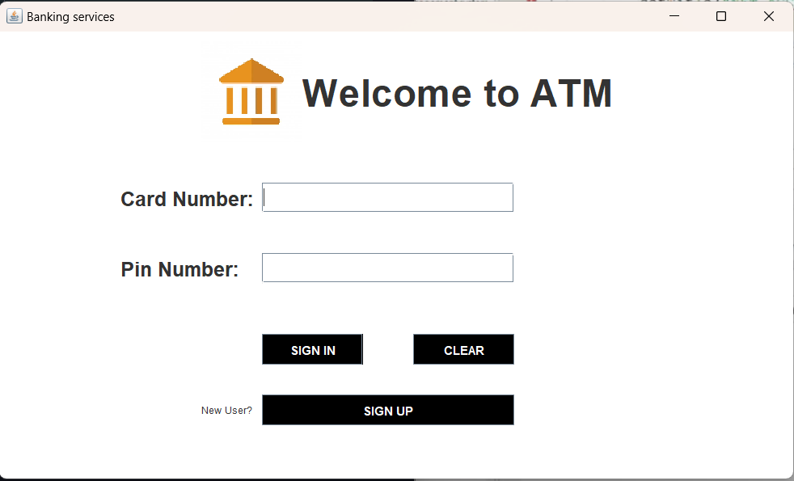
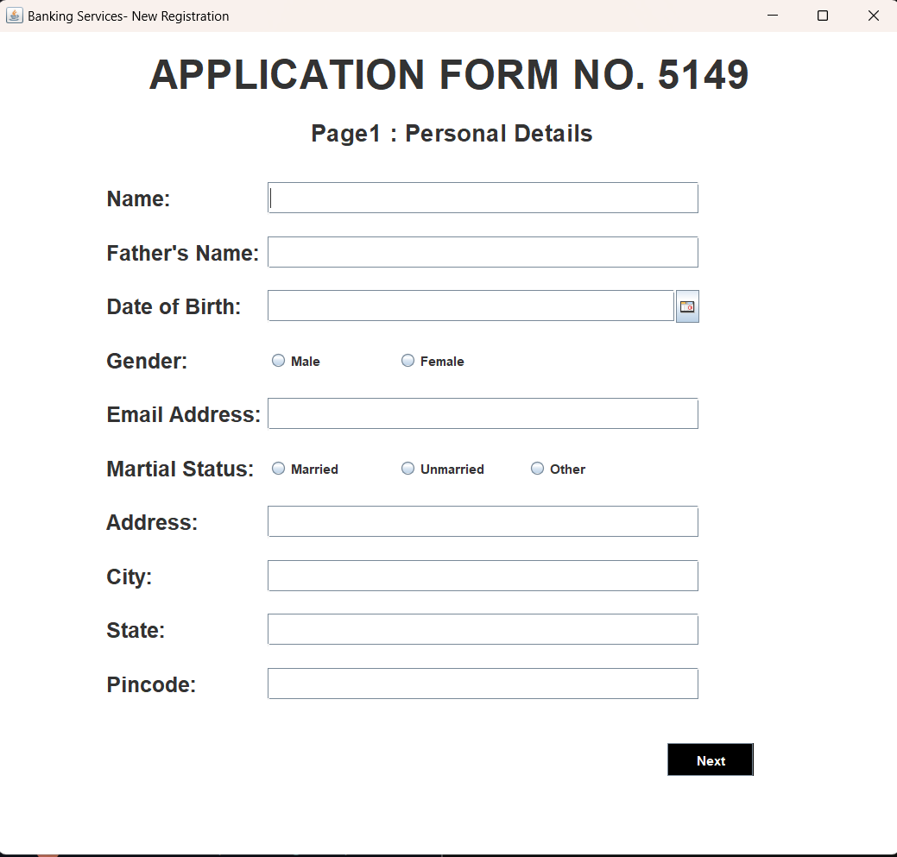
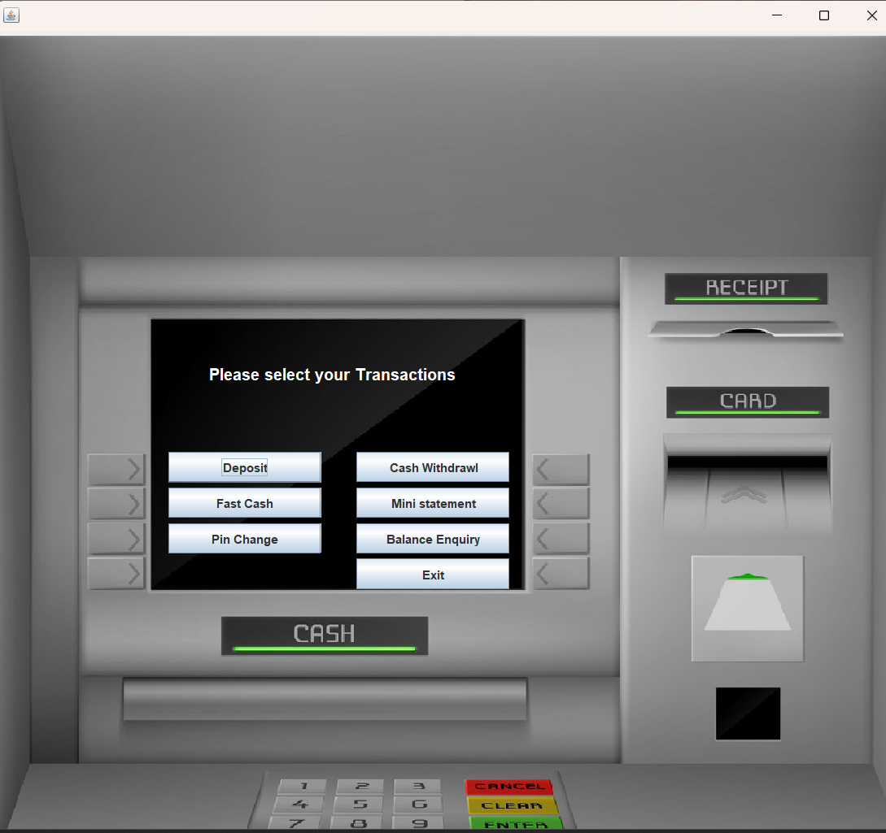

# Bank Management System

This project is a secure and efficient internet banking system developed in Java, designed to provide net banking facilities to banking customers. The application uses **Java AWT** and **Swing** to create a user-friendly graphical interface, allowing users to perform essential banking operations securely. The backend is powered by **MySQL**, which stores user data and transaction information.

---

## Features

- **User Authentication:**
  - Secure login using account ID and password.

- **Banking Operations:**
  - Transfer money to other accounts (intra-bank and inter-bank).
  - Add payees for convenient money transfers.
  - Receive money through Western Union integration.
  - View transaction history and manage account details.

- **Database Integration:**
  - Efficient storage and management of user data and transactions using a MySQL database.

---

       
Fig.1: Login Page

---

   
Fig.2: New User Application Form

---

      
Fig.3: Virtual ATM

---

## About Java Swing

Java Swing is a part of the **Java Foundation Classes (JFC)**, which provides a set of GUI components and tools to develop rich user interfaces for Java applications. Swing is built on top of the **AWT (Abstract Window Toolkit)** and provides a more flexible and feature-rich alternative to AWT components.

In this project, **Java Swing** is used to create the graphical user interface (GUI). It allows users to interact with the system through various components such as buttons, text fields, and labels, ensuring a seamless banking experience. Swing components are platform-independent, meaning the application will look and behave the same across different operating systems.

---

## Setup Instructions

### Prerequisites

1. **Java Development Kit (JDK):** Ensure you have JDK 8 or higher installed.
2. **MySQL Server:** Install MySQL and set up the database.

---

### Steps to Run the Code in IntelliJ IDEA

1. **Download the Repository:**
   - Download the ZIP file of the repository from GitHub and extract it to a desired location on your desktop.

2. **Open the Project in IntelliJ:**
   - Open IntelliJ IDEA.
   - Select **Open** and navigate to the folder where you extracted the project. Open the folder in IntelliJ.

3. **Configure the Project:**
   - IntelliJ should automatically recognize it as a Java project. If not, configure it as a Java project by navigating to **File > Project Structure** and ensuring the project is set as a **Java Application**.

4. **Set Up the Database:**
   - Import the `bankmanagement.sql` file into MySQL using a database client or MySQL Workbench.
   - Update the database credentials in the `db-config.properties` file.

5. **Add JAR Files/Libraries in IntelliJ IDEA:**
   To add external libraries or JAR files to your project in IntelliJ, follow these steps:

   1. **Step 1:** Download the necessary JAR files (e.g., MySQL Connector/J, any additional libraries for Swing, etc.).
   2. **Step 2:** Open the project in IntelliJ IDEA.
   3. **Step 3:** Navigate to **File > Project Structure** or press **Ctrl + Alt + Shift + S**.
   4. **Step 4:** In the Project Structure window, select **Modules** from the left-hand pane.
   5. **Step 5:** Select the **Dependencies** tab on the right, then click the **+** icon to add a new dependency.
   6. **Step 6:** Choose **JARs or directories** and browse to the location where you downloaded the required JAR files. Select the JAR files and click **OK**.
   7. **Step 7:** The JAR files will now be added as dependencies in your project. Click **Apply** and then **OK** to save the changes.

6. **Run the Project:**
   - Run the Java application in IntelliJ. The GUI will launch, and you can interact with the banking system directly from the Swing-based interface.

---

## Contribution

Contributions are welcome! Follow these steps to contribute:

1. Fork the repository.
2. Create a new branch for your feature/bug fix.
3. Commit your changes and submit a pull request.

---

## Credits

Special thanks to **[Code for Interview](https://www.youtube.com/playlist?list=PL_6klLfS1WqE1-_MJgZiJqAaccjLGHh0H)** for providing valuable guidance and tutorials.

---

## Contact

For queries or support, reach out to:

- **Email:** [vrdy69@gmail.com](mailto:vrdy69@gmail.com)
- **GitHub:** [VrdyEngineered](https://github.com/VrdyEngineered)
